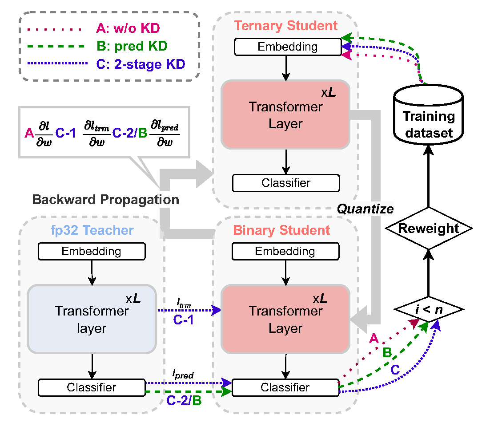

# BEBERT: Efficient and Robust Binary Ensemble BERT

Created by [jiayi Tian](https://ttttttris.github.io/), [Chao Fang](https://0-scholar-google-com.brum.beds.ac.uk/citations?hl=zh-CN&user=3wg-QTgAAAAJ), [Zhongfeng Wang](https://0-scholar-google-com.brum.beds.ac.uk/citations?user=faC-qekAAAAJ&hl=zh-CN) from Nanjing University and [Haonan Wang](https://0-scholar-google-com.brum.beds.ac.uk/citations?user=AQuXJEkAAAAJ&hl=zh-CN) from the University of Southern California.

This project is an implementation of our paper at ICASSP 2023 *BEBERT: Efficient and robust binary ensemble BERT* [[PDF](http://arxiv.org/abs/2210.15976)].

## Introduction

Pre-trained BERT models have achieved impressive accuracy on natural language processing (NLP) tasks. However, their excessive amount of parameters hinders them from efficient deployment on edge devices. Binarization of the BERT models can significantly alleviate this issue but comes with a severe accuracy drop compared with their full-precision counterparts. In this paper, we propose an efficient and robust binary ensemble BERT (BEBERT) to bridge the accuracy gap. To the best of our knowledge, this is the first work employing ensemble techniques on binary BERTs, yielding BEBERT, which achieves superior accuracy while retaining computational efficiency. Furthermore, we remove the knowledge distillation procedures during ensemble to speed up the training process without compromising accuracy. Experimental results on the GLUE benchmark show that the proposed BEBERT significantly outperforms the existing binary BERT models in accuracy and robustness with a 2× speedup on training time. Moreover, our BEBERT has only a negligible accuracy loss of 0.3% compared to the fullprecision baseline while saving 15× and 13× in FLOPs and model size, respectively. In addition, BEBERT also outperforms other compressed BERTs in accuracy by up to 6.7%.



## Dependencies
```bash
pip install -r requirements.txt
```

## Datasets

We train and test BinaryBERT on [GLUE benchmarks](https://github.com/nyu-mll/GLUE-baselines). For data augmentation on GLUE, please follow the instruction in [TinyBERT](https://github.com/huawei-noah/Pretrained-Language-Model/tree/master/TinyBERT).

## Instructions

Our experiments are based on the fine-tuned full-precision DynaBERT, which can be found [here](https://drive.google.com/file/d/1pYApaDcse5QIB6lZagWO0uElAavFazpA/view?usp=sharing). **Complete running scripts and more detailed tips are provided in `./scripts`. Note that there are two steps for running ensemble BinaryBERT.** The first step does not require ensemble, and when employing ensemble in the second step, please train a half-sized ternary BERT in advance.

### Step one: Train a half-sized ternary BERT

Please refer to `./binarybert/scripts/ternary_glue.sh`.

### Step two: Apply TWS and BinaryBERT ensemble
Please refer to `./binarybert/scripts/benn_glue_{A,B,C}.sh`. 

## Acknowledgement

Our release code is developed based on [BinaryBERT](https://github.com/huawei-noah/Pretrained-Language-Model/tree/master/BinaryBERT) and [BiBERT](https://github.com/htqin/BiBERT). Thanks a lot.

## Citation

If you find our work useful in your research, please consider citing:

```shell
@inproceedings{tian2023bebert,
  title={BEBERT: Efficient and Robust Binary Ensemble BERT},
  author={Tian, Jiayi and Fang, Chao and Wang, Haonan and Wang, Zhongfeng},
  booktitle={2023 IEEE International Conference on Acoustics, Speech, and Signal Processing (ICASSP)},
  year={2023},
  organization={IEEE}
}
```
